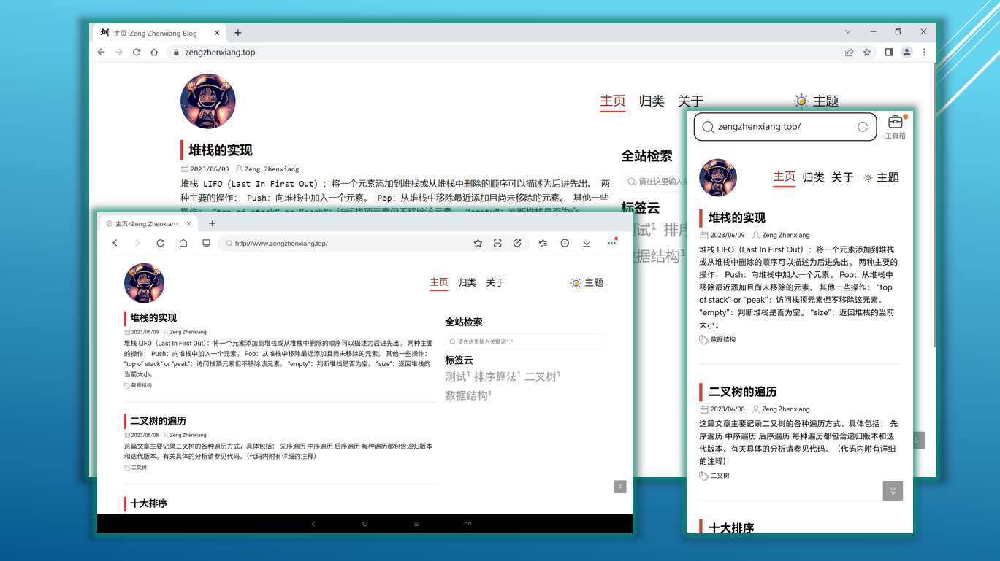
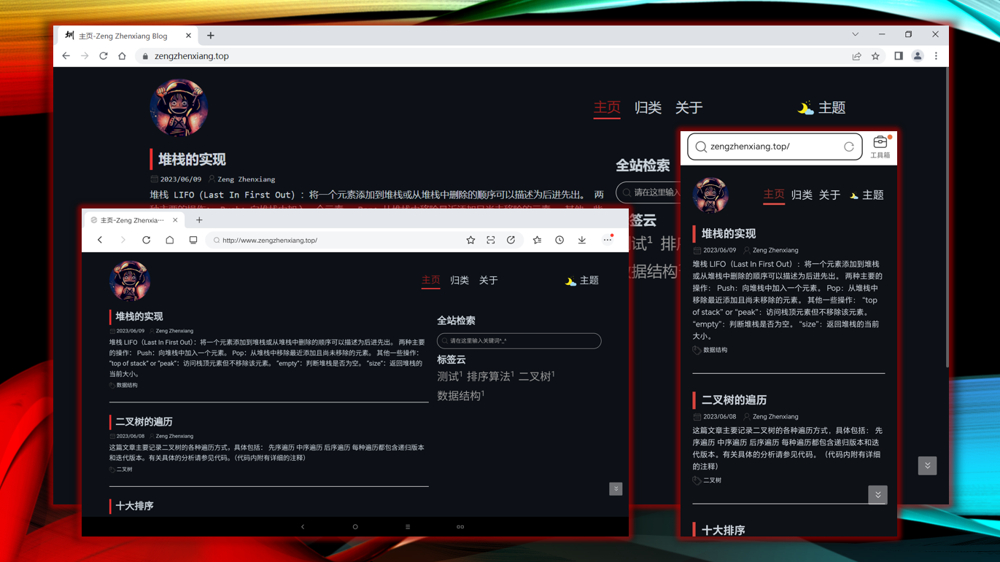
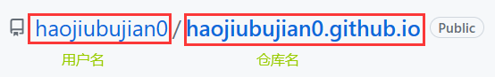

# 简介
 

这是一款**简洁**、**醒目**的Jekyll主题。

主题**在线预览**☞[主题预览](https://www.zengzhenxiang.top/posts/2023/05/31/%E4%B8%BB%E9%A2%98%E9%A2%84%E8%A7%88.html)   

主题**图片预览**☟  

# 特性

- 响应式设计，在PC端、移动端以及平板上都有良好的体验。
- 主题支持白天和夜间两种模式。
- 代码高亮（由rouge支持）。
- 数学公式（由mathjax支持）。
- 支持全文检索。
- 支持网站流量统计（由百度统计支持）。
- 支持评论区（由Gitalk支持）。
- 支持常用的网站侧边栏部件：标签云、文章目录。

# 安装

1. 将项目克隆至本地，请在本地将项目根目录下的CNAME文件删除（CNAME文件用于域名解析）。

2. 在你的github账户下新建一个仓库，仓库命名的格式为：**username.github.io**，其中username是你在github上的用户名。如果仓库名不是按照这样的格式，那么最终网站将无法工作。下面是一个正确的示例：

   

3. 先前克隆的本项目上传至第2个步骤中新建的空仓库。

4. 到这一步就完成了，接下来你可以通过**https://username.github.io**来访问你的站点，这里username是你在github上的用户名。

**关于GitHub Pages**

你可以从以下地址获取更详细的内容。

☞[GitHub Pages | Websites for you and your projects, hosted directly from your GitHub repository. Just edit, push, and your changes are live.](https://pages.github.com/)

☞[Quickstart for GitHub Pages - GitHub Docs](https://docs.github.com/en/pages/quickstart)

# 使用

在前面的**安装**中，虽然可以使网站运作，但站点中的内容都是关于我的。那么，如何将站点重新定义为专属于你自己的呢？关于这部分内容，请参见**Jekyll**☞[Quickstart | Jekyll • Simple, blog-aware, static sites (jekyllrb.com)](https://jekyllrb.com/docs/)。

**基本使用**

- 清空_posts目录下关于我的文章，在该目录下写入你自己的文章，注意文章的命名格式为：
  **yyyy-MM-dd-文章标题.md** 。

- 文章的资源请放在posts目录下（不是必须的）。
